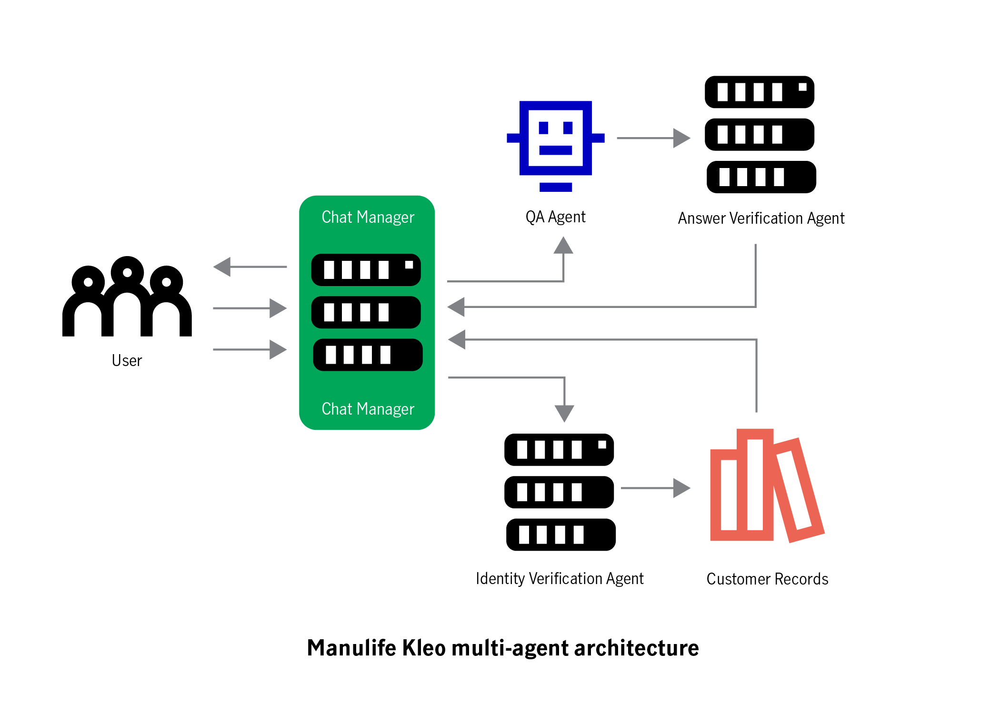

# Manulife Kleo AI-Assistant

This is a Python-based chatbot specifically designed to handle renewal-related queries for Manulife Bank.

## Key Files

- `chatbot_final.ipynb`: Main program file containing the core chatbot logic
- `dummy_data (1).csv`: Simulated customer data for testing
- `merged_qa_dataset.json`: Question-answer dataset
- `index.html`: HTML file for the chat interface
- `style.css`: CSS file for styling the chat interface
- `script.js`: JavaScript file for chat interface functionality
- `Dummy_Data.ipynb`: File to create dummy data

## Features

- Answers general questions and personal account-related queries
- User identity verification
- Handles specific prepayment privilege questions

## Note

- Ensure `dummy_data (1).csv` and `merged_qa_dataset.json` are in the correct directory
- Personal information queries require identity verification

 ## Chatbot Workflow

   The following flowchart illustrates the main workflow of the Manulife Kleo Chatbot:

   

This diagram demonstrates the interaction between:

1. **ChatbotManager**: Orchestrates the overall conversation flow and manages user interactions.
2. **QAAgent**: Handles general question answering and retrieves relevant information from the knowledge base.
   - Inside QAAgent: An answer validation agent ensures the accuracy and relevance of the retrieved answers.
3. **VerificationAgent**: Manages user identity verification for personal queries.

The workflow shows how these agents work together to:
- Recognize user intent
- Process personal and general questions
- Perform identity verification when necessary
- Retrieve, validate, and format appropriate answers

Key steps in the process:
1. ChatbotManager receives user input and determines if it's a personal or general question.
2. For personal questions, VerificationAgent checks user identity before proceeding.
3. QAAgent processes the question:
   a. Retrieves potential answers from the knowledge base.
   b. The internal validation agent checks the relevance and accuracy of the answers.
   c. Returns the most appropriate validated answer.
4. ChatbotManager formats and delivers the final response to the user.

This multi-layered, collaborative approach ensures efficient, secure, and accurate handling of various types of user queries, from general information requests to personal account inquiries.
